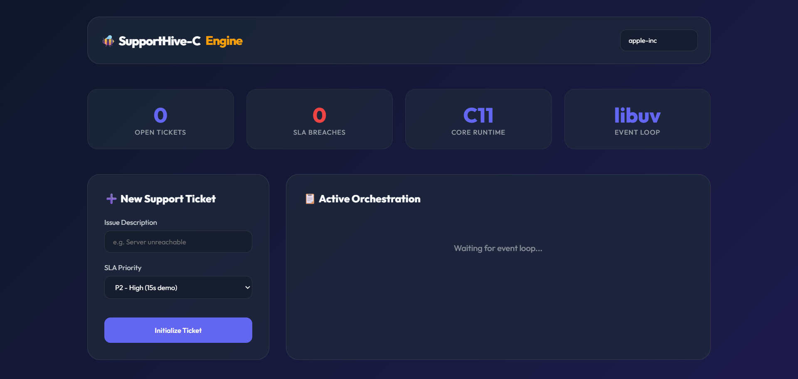

# SupportHive-C 🐝

**High-Performance Multi-Tenant Support & SLA Engine built in C.**

SupportHive-C is a systems-level backend designed for sub-millisecond orchestration of customer support tickets and high-precision SLA (Service Level Agreement) enforcement.

## 🚀 Extraordinary Architecture

Unlike traditional web applications built in Rails or Node, SupportHive-C uses a **single-threaded non-blocking event loop** (libuv) to manage thousands of concurrent ticket lifecycles with minimal overhead.

## 🏗️ Architectural Flow
```text
[ Client ] <--> [ libuv Layer ] <--> [ http-parser ]
                     |                    |
                     |             [ JSON Logic (cJSON) ]
                     |                    |
              [ SLA Engine ] <------> [ SQLite3 DB ]
              (Async Timers)          (Multi-Tenant)
```
- **Event Loop**: `libuv` (the engine inside Node.js).
- **HTTP Engine**: Zero-copy parsing via `http-parser`.
- **Concurrency**: Purely event-driven; no thread-switching latency.
- **SLA Engine**: Real-time high-precision timers (`uv_timer_t`) map to ticket priorities.
- **Persistence**: Multi-tenant scoped SQLite3 data layer.
- **Notifiers**: Automated alerting for escalations and ticket events.

## 🧠 Multi-Tenant Model
The system uses strict header-based isolation. Every request must include an `X-Tenant-ID`.
- No shared data between tenants.
- All database queries are automatically scoped by tenant identity.

## ⏱️ SLA Priority Logic
- **P1 (Critical)**: SLA Breach in **5 seconds** (for demo) -> Immediate Escalation to L1 Supervisor.
- **P2 (High)**: SLA Breach in **15 seconds** -> Automated Notification to Management.
- **Default**: 60-second threshold.

## 🛠️ Build & Run
The project includes a **portable toolchain** (CMake + GCC) inside the `./tools` directory.

### Build
```powershell
./build_portable.ps1
```

### Run
```powershell
./build/supporthive.exe
```

## 📱 Mobile Access (Android/iOS)
The engine now serves its own dashboard! Review it in real-time on your mobile device:
1. Ensure your phone is on the same Wi-Fi as your computer.
2. Open your mobile browser.
3. Navigate to: `http://192.168.18.204:7000/dashboard`

## 📊 Visual Showcase

*Figure 1: The Command Center showing active ticket orchestration and real-time SLA breach monitoring.*

## 🧪 API Usage

### 1. Create a Ticket
```bash
curl -X POST http://localhost:7000/tickets \
     -H "X-Tenant-ID: apple-inc" \
     -H "Content-Type: application/json" \
     -d '{"title": "iCloud Sync Failure", "priority": "P1"}'
```

### 2. Monitor Stats
```bash
curl -H "X-Tenant-ID: apple-inc" http://localhost:7000/stats
```

## 📊 Observability
The server prints real-time logs of ticket creation, active timers, and SLA breaches. Every breach is logged to the `escalations` table for auditing and compliance.

---
*Built for environments where performance and reliability are the only metrics that matter.*
