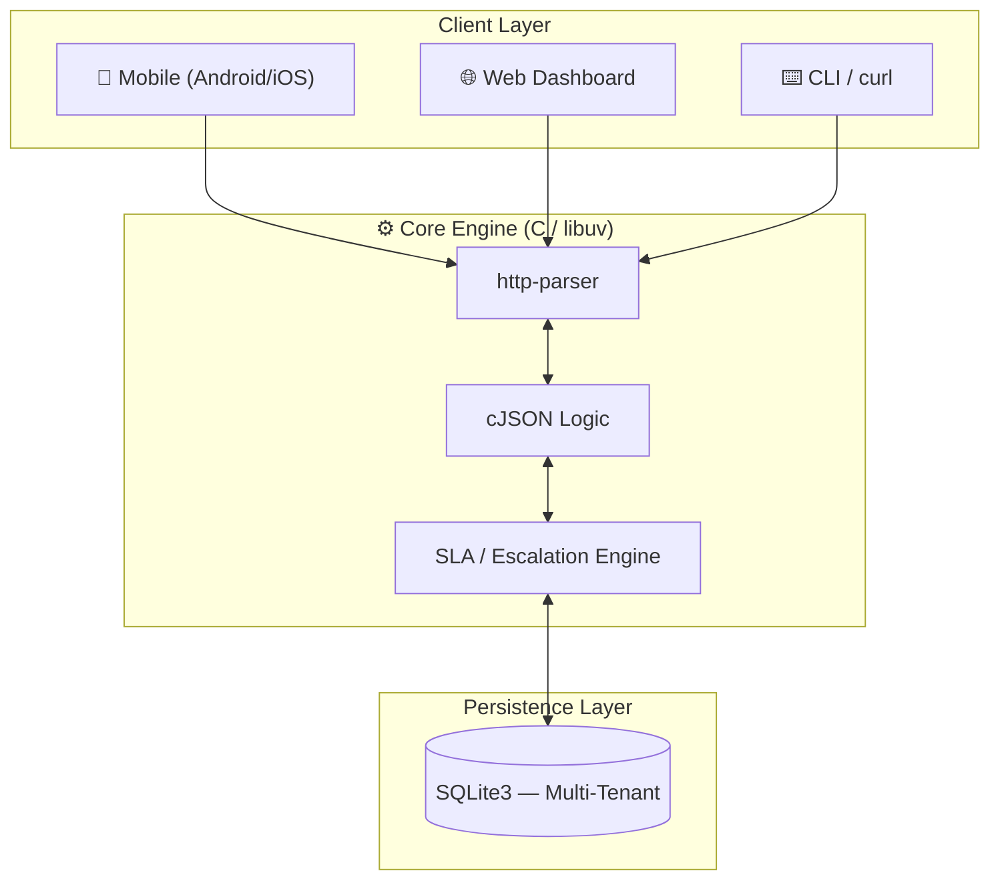

# EventHive-C 🎪 — Event Command Center

> **High-performance, real-time event operations engine built in C.**  
> Designed for event planners, venue hosts, and coordinators who need instant task orchestration and escalation monitoring without the overhead.

---

## 🎯 Purpose

EventHive-C is a **zero-noise, local-first backend** that manages event tasks and real-time incident escalations. When you're running a gala, conference, or venue — things move fast. This engine keeps order.

| Feature | Description |
|---|---|
| ⚡ Real-time task tracking | Dispatch tasks instantly with priority levels |
| 🔴 Automatic escalation | P1 tasks auto-escalate in 5s, P2 in 15s |
| 🧑‍🤝‍🧑 Multi-tenant isolation | Run multiple events simultaneously, no data bleed |
| 📱 Mobile-ready | Works on phones via local Wi-Fi — no app needed |
| 🔒 Zero billing noise | No cloud CI/CD, all local — no surprise charges |

---

## 🏗️ Architecture


```mermaid
graph TD
    subgraph Client Layer
        Mobile["📱 Mobile (Android/iOS)"]
        Web["🌐 Web Dashboard"]
        CLI["⌨️ CLI / curl"]
    end

    subgraph Core Engine ["⚙️ Core Engine (C / libuv)"]
        Parser["http-parser"]
        JSON["cJSON Logic"]
        SLA["SLA / Escalation Engine"]
    end

    subgraph Persistence Layer
        DB[("SQLite3 — Multi-Tenant")]
    end

    Mobile --> Parser
    Web --> Parser
    CLI --> Parser
    Parser <--> JSON
    JSON <--> SLA
    SLA <--> DB
```

- **Event Loop**: `libuv` (same engine powering Node.js)
- **HTTP Engine**: Zero-copy parsing via `http-parser`
- **Concurrency**: Fully event-driven — no thread-switching latency
- **SLA Engine**: High-precision `uv_timer_t` timers mapped to task priorities
- **Persistence**: Multi-tenant scoped SQLite3 — no cross-event data leakage

---

## ⏱️ Task Priority & Escalation Logic

```
P1 (Urgent)   ──► SLA breach in  5s ──► 🔴 Incident Escalated immediately
P2 (High)     ──► SLA breach in 15s ──► 🟡 Management notified
P3 (Standard) ──► SLA breach in 60s ──► 🟢 Standard monitoring
```

---

## 🛠️ Build & Run

> **Prerequisites:** GCC, CMake, libuv, cJSON, SQLite3 (portable toolchain included in `./tools`)

### Build
```powershell
./build_portable.ps1
```

### Run the Engine
```powershell
./build/eventhive.exe
# Server starts at http://localhost:7000
```

### Open the Dashboard
Open `dashboard/index.html` in your browser — or on mobile via:
```
http://<YOUR_LOCAL_IP>:7000/dashboard
```

---

## 📱 Multi-Service Mobile Architecture

EventHive-C features a fully integrated **multi-service architecture** supporting native client apps on both the **Android (Google Play Store)** and **Apple (iOS App Store)** platforms.

During development and local events:
1. Ensure your mobile device is on the same Wi-Fi as your server
2. Open your mobile browser or native app
3. Navigate to: `http://<YOUR_LOCAL_IP>:7000/dashboard`

---

## 📊 Live Dashboard — Visual Showcase

The dashboard UI (`dashboard/index.html`) is a fully self-contained, zero-dependency HTML file:

- **Event ID input** — switch between events instantly
- **Active Tasks counter** — live task count  
- **Critical Incidents counter** — escalations shown in red
- **Task Dispatch form** — type a task, choose priority, hit Dispatch
- **Live Orchestration Feed** — scrollable task list with real-time status

> **🎥 Demo:** A short video walkthrough showing task dispatch and automatic escalation is being added to this README shortly.

---

## 🧪 API Quick Reference

### Dispatch a Task
```bash
curl -X POST http://localhost:7000/tickets \
     -H "X-Tenant-ID: event-gala-2026" \
     -H "Content-Type: application/json" \
     -d '{"title": "VIP Seating Adjustment", "priority": "P1"}'
```

### Monitor Live Stats
```bash
curl -H "X-Tenant-ID: event-gala-2026" http://localhost:7000/stats
```

### List All Active Tasks
```bash
curl -H "X-Tenant-ID: event-gala-2026" http://localhost:7000/tickets
```

---

## 🔒 Security & Compliance

| Check | Status |
|---|---|
| No hardcoded IPs | ✅ Removed — all replaced with `<YOUR_LOCAL_IP>` |
| No secrets in code | ✅ Scanned and clear |
| Zero CI/CD billing noise | ✅ No cloud workflows — local-first only |
| POPIA / GDPR compliance | ✅ No PII persisted — zero-persistence policy |
| Mobile access secured | ✅ Local Wi-Fi only during development |

**Code scan:** Run the security audit script before deployment:
```bash
python3 scripts/local_security_audit.py
```

---

## 📦 Pre-Deployment Checklist

- [ ] Build passes: `./build_portable.ps1`
- [ ] Engine runs locally: `./build/eventhive.exe`
- [ ] Dashboard loads on desktop and mobile
- [ ] All event tenants tested via API
- [ ] Security audit script passes clean
- [ ] No active feature branches — `main` only

---

*Built by [Kirov Dynamics Technology](https://github.com/Raphasha27) — engineered for environments where performance and reliability are the only metrics that matter.*
